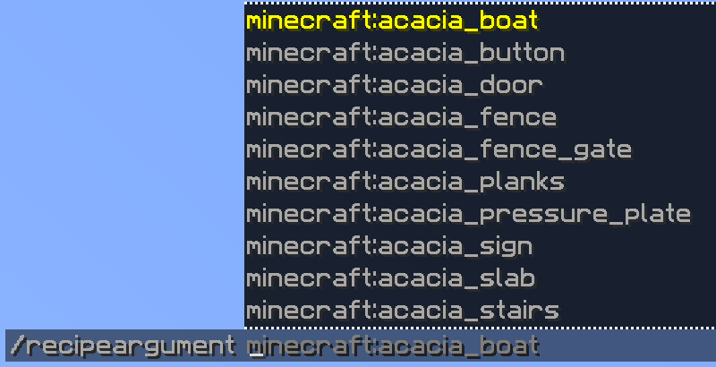

# Recipe arguments



The `RecipeArgument` class lets you retrieve Bukkit's `ComplexRecipe` object.

<div class="example">

### Example - Giving a player the result of a recipe

Say we want to give yourself the result of a specific recipe. Since Bukkit's `Recipe` class contains the `getResult()` method, we will use that in our example. We want to create the following command:

```mccmd
/giverecipe <recipe>
```

As such, we easily implement it by specifying the `RecipeArgument`, casting it and adding it to the player's inventory:

```java
{{#include ../../CommandAPI/commandapi-core/src/test/java/Examples.java:recipearguments}}
```

</div>

<div class="example">

### Example - Unlocking a recipe for a player

In this example, we'll use the `ComplexRecipe`'s `getKey()` method to write an example to to unlock a recipe for a player. For this command, we'll use the following syntax:

```mccmd
/unlockrecipe <player> <recipe>
```

This is then implemented trivially as follows:

```java
{{#include ../../CommandAPI/commandapi-core/src/test/java/Examples.java:recipearguments2}}
```

</div>